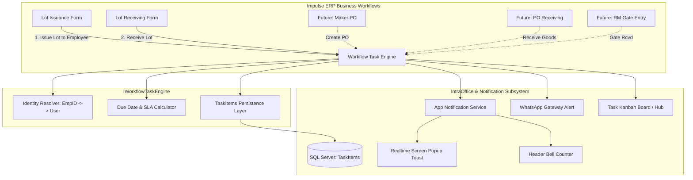

# Architecture & Implementation Plan: Centralized Workflow Task Management Engine

## Overview & Executive Summary

The objective of this initiative is to bridge **Impulse ERP core operations** (such as Factory Lot Issuance, Maker POs, Raw Material Gate Receiving, and Subcontractor Work) with the **IntraOffice Task & Real-time Notification Ecosystem**.

Currently, tasks in IntraOffice are manually created from the Kanban Task Board (`TaskBoard.razor`). When a task is assigned, the system dispatches:
1. An in-app popup toast notification (`IAppNotificationService` &rarr; `NotificationToaster.razor`).
2. An unread task badge on the global header (`NotificationBell.razor`) and top bar.
3. An optional WhatsApp mobile message (`IWhatsAppNotificationService`).
4. An entry in the user's active task queue (`TaskItems`).

The goal is to establish a **Centralized Workflow Task Engine (`IWorkflowTaskEngine`)** that automatically initiates, tracks, alerts, and completes tasks during standard Impulse transactions—beginning with **Lot Issuance &rarr; Lot Receiving** as the blueprint for all future workflows.

---

## 1. Deep-Dive Study of Current Systems

### 1.1 The Task Assignment & Notification Subsystem
* **Data Model (`TaskItems`):**
  * Primary Key: `Id` (INT).
  * Fields: `Title`, `Description`, `AssignedTo`, `AssignedBy`, `DepartmentId`, `Priority` (0=Low, 1=Normal, 2=High, 3=Urgent), `Status` (0=Pending, 1=InProgress, 2=Completed, 3=Cancelled), `DueDate`, `WhatsAppMessageSent`, `EmailMessageSent`, `CreatedAt`, `CompletedAt`.
  * Supporting Tables: `TaskComments`, `TaskAttachments`, `TaskStatusHistories`.
* **Current Task Creation Lifecycle (`IntraOfficeAdapters.CreateTaskAsync`):**
  1. Inserts record into `TaskItems` via `IntraOfficeDataAccess.CreateTaskAsync`.
  2. Dispatches `AppNotification` with `Category = NotificationCategory.Task` via `IAppNotificationService.SendNotificationAsync`.
  3. All connected browser sessions running `NotificationToaster.razor` catch the event in real-time. If the notification targets the logged-in user, a toast pops up with sound/chime.
  4. If `sendWhatsApp == true` and the assignee has a valid phone number, dispatches an automated WhatsApp alert.
* **Current Task Closing Lifecycle (`IntraOfficeAdapters.UpdateStatusAsync`):**
  1. Updates `TaskItems.Status` to `TaskItemStatus.Completed` (value `2`) and records `CompletedAt = GETUTCDATE()`.
  2. Logs transition record into `TaskStatusHistories`.
  3. Sends completion notification to the original assigner.

### 1.2 The Production Lot Issuance Subsystem (`LotIssuance.razor.cs`)
* **Trigger Point:** `SaveLotIssuance()` in `Impulse/Pages/Production/LotIssuance/LotIssuance.razor.cs`.
* **Key Entities & Inputs:**
  * `SelectedProcessID`: Target production process (e.g., Cutting, Forging, Machining).
  * `SelectedMaker`: Maker/Vendor (e.g., In-House Factory, Vendor #79, Subcontractor).
  * `SelectedWorker` (`EmployeeLookupModel`): Chosen factory employee (`EmpID`, `Name`, `Designation`).
  * `StagedItems`: List of lot items containing `LotNo`, `ItemCode`, `IssuanceQty`, `OrderNo`, `ReturnProcessID`.
* **Database Persistence:**
  * Calls `LotIssuanceService.SaveLotIssuanceAsync(headerPayload, linePayloads, userName, userId, machineName)`.
  * Generates a unique `VendIssued.EntryID` (Header ID) and `VendIssuedDetail` lines.
  * In `VendIssued`, `IssEmpID` is set to `SelectedWorker.EmpID`.
  * `DT = DateTime.Today`, `ReturnDT` is recorded.

### 1.3 The Production Lot Receiving Subsystem (`ReceiveLot.razor.cs`)
* **Trigger Point:** `SaveReceiving()` in `Impulse/Pages/Production/ReceiveLot/ReceiveLot.razor.cs`.
* **Key Entities & Inputs:**
  * `LotHeader.EntryID`: **The exact `VendIssued.EntryID` that was issued.**
  * `LotHeader.LotNo`: The Lot number.
  * `SelectedWorkers`: One or more factory workers receiving the lot.
  * `Lines`: Received quantities (`ReceivingQty`), wastage, repair quantities.
* **Database Persistence:**
  * Calls `ReceiveLotService.SaveLotReceivingAsync(headerPayload, linePayloads, userName, userId, machineName)`.
  * Inserts into `VendRcvd` and `vendRcvdDetail`.
  * `vendRcvdDetail.RefID` stores the original `VendIssued.EntryID`.
  * Can mark the issuance as partially received or fully closed (`VendIssued.Closed = 1`).

### 1.4 The Identity Gap: Employees (`EmpID`) vs. Users (`UserName`/`UserId`)
* `LotIssuance` selects an **Employee** (`EmpID`, e.g., `"EMR-00045"`).
* `TaskItems` assigns to a **User** (`AssignedTo`, e.g., `"kashif"`).
* **Investigation Findings:**
  * The `Users` table in SQL Server includes `EmpID VARCHAR(50) NULL`.
  * Currently in the database, some employees have a linked `Users` login, while shop-floor factory workers may only exist in `Employees` (with `Phone1` for SMS/WhatsApp).
  * **Solution:** The centralized engine will implement a **Two-Tier Identity Resolver**:
    1. If `EmpID` maps to a `Users.UserName`, assign the task directly to `Users.UserName` (so they see it on their desktop/mobile ERP screen and get real-time browser popups).
    2. If no `Users` record exists for that `EmpID`, assign the task with `AssignedTo = EmpID`, set `AssigneeName = Employee.Name`, and optionally notify the department supervisor's ERP login while delivering mobile alerts to the employee's phone (`Employees.Phone1`).

---

## 2. Centralized Architecture: `IWorkflowTaskEngine`

Instead of coupling task creation and closing logic directly inside individual Razor pages, we introduce a dedicated, reusable service layer:



---

## 3. Detailed Technical Design

### 3.1 Database Enhancements (Non-breaking, lightweight)
To make task linkage unambiguous, fast, and multi-workflow capable, we will add two indexed metadata columns to `TaskItems`:

```sql
IF NOT EXISTS (SELECT * FROM sys.columns WHERE object_id = OBJECT_ID('TaskItems') AND name = 'SourceEntityType')
BEGIN
    ALTER TABLE [dbo].[TaskItems] ADD [SourceEntityType] NVARCHAR(50) NULL;
    ALTER TABLE [dbo].[TaskItems] ADD [SourceEntityRefId] NVARCHAR(100) NULL;
    CREATE NONCLUSTERED INDEX [IX_TaskItems_SourceEntity] ON [dbo].[TaskItems]([SourceEntityType], [SourceEntityRefId]);
END
```

* **`SourceEntityType`**: Identifies the origin workflow (e.g. `'LotIssuance'`, `'MakerPO'`, `'PurchaseOrder'`).
* **`SourceEntityRefId`**: Identifies the exact business document ID (e.g. `VendIssued.EntryID` like `'10452'`, or composite `'LOT:2026-0042'`).

### 3.2 Service Interface: `IWorkflowTaskEngine`

```csharp
public interface IWorkflowTaskEngine
{
    /// <summary>
    /// Creates and dispatches a workflow task with real-time popup & WhatsApp alerts.
    /// </summary>
    Task<TaskItem> CreateWorkflowTaskAsync(WorkflowTaskCreateRequest request);

    /// <summary>
    /// Automatically closes all active tasks linked to an entity when the paired event occurs.
    /// </summary>
    Task<bool> CompleteWorkflowTaskAsync(string entityType, string entityRefId, string completedByUserId, string? completionNotes = null);

    /// <summary>
    /// Cancels active workflow tasks if an issuance or order is voided/cancelled.
    /// </summary>
    Task<bool> CancelWorkflowTaskAsync(string entityType, string entityRefId, string cancelledByUserId, string? cancelReason = null);

    /// <summary>
    /// Computes the dynamic due date based on process SLA, quantity, and calendar days.
    /// </summary>
    DateTime CalculateDueDate(WorkflowDueDateContext context);
}
```

### 3.3 Dynamic Due Date Calculation Logic
The user noted: *"a task should also be marked to that user with a due date for which we will develop a logic."*

We will establish a modular due-date strategy:
1. **Rule 1: Form-specified Date (if provided):** If the user specifies an explicit target return date on the issuance screen (`ReturnDT`), use that date.
2. **Rule 2: Process-based Standard Turnaround Days:**
   * A configurable mapping table or rule dictionary:
     * *Cutting / Blanking:* Issue Date + 1 working day.
     * *Forging / Stamping:* Issue Date + 2 working days.
     * *Machining / Milling:* Issue Date + 3 working days.
     * *Heat Treatment / Hardening:* Issue Date + 4 working days.
     * *Polishing / Grinding:* Issue Date + 2 working days.
     * *Default / Fallback:* Issue Date + 3 working days.
3. **Rule 3: Volume / Quantity Scaling Factor:**
   * If issuance quantity exceeds standard lot threshold (e.g., > 500 pcs), add +1 day per each 500 pcs.
4. **Rule 4: Working Days Only (Exclude Sundays/Holidays).**

---

## 4. Blueprint Workflow Walkthrough: Lot Issuance &rarr; Lot Receiving

### Step A: Issuance (Task Creation & Alerts)
1. Supervisor opens `LotIssuance.razor`, selects Lot `#2026-104`, Process `Machining`, Maker `Factory (In-House)`, and Worker `Muhammad Kashif (EMR-00045)`.
2. Supervisor clicks **"Save & Post Issuance"**.
3. `SaveLotIssuanceAsync` creates the `VendIssued` record with `headerId = 10452`.
4. The system immediately invokes:
   ```csharp
   await WorkflowTaskEngine.CreateWorkflowTaskAsync(new WorkflowTaskCreateRequest
   {
       SourceEntityType = "LotIssuance",
       SourceEntityRefId = headerId.ToString(),
       LotNo = SearchLotNo,
       TargetEmpID = SelectedWorker.EmpID,
       ProcessName = selectedProcessName,
       ItemCodes = validLines.Select(l => l.ItemCode).ToList(),
       TotalQuantity = TotalIssuanceQty,
       DueDate = calculatedDueDate,
       CreatedByUserId = currentUserName,
       ActionUrl = $"/production/receivelot?lotNo={SearchLotNo}"
   });
   ```
5. **Immediate Effects:**
   * Record created in `TaskItems`.
   * **Real-time Popup Toast:** `NotificationToaster.razor` displays an animated popup on the assigned user's screen with task summary and "Open" action button.
   * **Bell Icon:** Increments unread count for the worker.
   * **Mobile / WhatsApp:** Automated alert sent to worker's phone:
     > *"New Work Assignment: Lot #2026-104 (500 pcs) for Machining. Due: 26-Sep-2026. Assigned by Administrator."*

### Step B: Receiving (Task Auto-Closure)
1. Worker completes the job and brings the lot to the receiving station.
2. In `ReceiveLot.razor`, operator scans or enters Lot `#2026-104`.
3. Operator enters received quantity and clicks **"Save Receiving"**.
4. `SaveLotReceivingAsync` persists the receiving voucher.
5. The system immediately invokes:
   ```csharp
   await WorkflowTaskEngine.CompleteWorkflowTaskAsync(
       entityType: "LotIssuance",
       entityRefId: LotHeader.EntryID.ToString(),
       completedByUserId: currentUserName,
       completionNotes: $"Received {TotalReceivingQty:N0} pcs in ReceiveLot entry #{rcvHeaderId}"
   );
   ```
6. **Immediate Effects:**
   * Task status is updated to `Completed` (`TaskItemStatus.Completed`).
   * `CompletedAt` timestamp recorded.
   * Task vanishes from "Pending" queue on Kanban Board and moves to "Completed".
   * Original supervisor receives a completion notification: *"Lot #2026-104 has been received and task closed."*

---

## 5. Extensibility to Future Workflows
Because this is designed as a centralized engine, expanding to other Impulse workflows requires only 2 lines of code in each respective service/component:
* **Maker PO &rarr; PO Receiving** (`"MakerPO"`, `MakerPONo`)
* **Raw Material PO &rarr; Vendor Gate Receiving** (`"RawMaterialPO"`, `PONo`)
* **Re-work Issuance &rarr; Re-work Quality Inspection** (`"ReWork"`, `ReWorkID`)
* **Sample Request &rarr; Sample Approval** (`"SampleDevelopment"`, `SampleID`)

---

## 6. Implementation Phasing & Next Steps

1. **Phase 1: Foundation (Zero Risk to Existing Operations)**
   * Add `SourceEntityType` and `SourceEntityRefId` to `TaskItems` table.
   * Create `IWorkflowTaskEngine` and `WorkflowTaskEngine.cs` in `Impulse/Services/WorkflowTasks/`.
   * Wire into DI in `Program.cs`.

2. **Phase 2: Pilot Integration on Lot Issuance & Lot Receiving**
   * Integrate task creation call in `LotIssuance.razor.cs`.
   * Integrate task completion call in `ReceiveLot.razor.cs`.
   * Add direct navigation links to `TaskBoard` so clicking a workflow task opens the corresponding lot details.

3. **Phase 3: Verification & Review**
   * Test Lot Issuance with in-house employee &rarr; verify real-time toast popup and Task Board placement.
   * Test Lot Receiving &rarr; verify automatic task status change to `Completed`.
